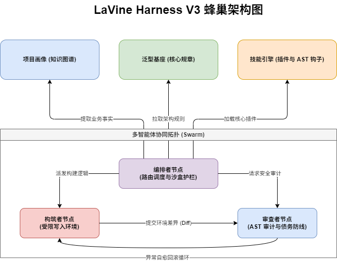

[📘 English](README.md) | [🇨🇳 简体中文](README-zh-CN-v2.md)

---

# LaVine Harness Skills: 智能体优先（Agent-First）的自主控制流体系架构 (V3.x 缰绳工程)

## 摘要 (Abstract & Epistemological Stance)

随着大语言模型（LLMs）及 IDE 终端级代理在工程域内的深度渗透，模型所面临的**“上下文碎片化” (Context Fragmentation)**、**“散发性幻觉” (Hallucinatory Scatter)** 与**“认知边界坍塌”**日益严重。针对此类系统级缺陷，**LaVine Harness (缰绳工程)** 提出了一套基于声明式规范（Declarative Constraints）与沙盒隔离矩阵的学术级工程架构框架。

区别于传统的、“人类中心化 (Anthropocentric)” 的长篇自然语言描述文档，本框架的根本目标在于彻底革新代码仓的 **机器可读性范式 (Machine-Readability Paradigm)**。它建立了一个强制性的智能体沙盒（Agentic Sandbox），相当于为模型提供了一条逻辑“缰绳”，使得其推理引擎（Heuristic Logic）能够精准映射到封闭域的代码图谱中，实现高内聚、低耦合的安全代码生成与验证循环。

## 🔬 核心底座与架构创新点 (Core Innovations)

### 1. 声明式本体论映射（机器可读性取代人类语言散文）
历史上的项目说明性文件往往由于自然语言的歧义性，带来极高的无用 Token 开销与逻辑噪声。本框架抛弃了漫无目的的文档堆砌，将全局的权限约束、开发策略统合为无状态冗余的 YAML/JSON 配置文件和 `core-specs/` 基座库，建立起极致降噪的数据结构环境。

### 2. 多智能体蜂巢拓扑网络（基于权限拆解的 Swarm 模型）
为解决单一自回归模型在长链路上容易产生的累积误差与行为越界陷阱，V3 引入了三层架构的拓扑引擎协动模型：
- **Orchestrator Node (编排者节点)**：仅受领高维度统筹命令，剥夺底层文件的物理写入权限，负责将指令降维并进行知识图谱装载。
- **Coder Node (构筑者节点)**：封闭于指定路径下的执行级智能边界内运行，无法越权扫描或篡改外部的系统依赖组件。
- **Reviewer Node (审查者节点)**：充当底盘的安全防线与自愈反馈源。通过监测 AST 抽象语法树变动比对架构协议要求，发现异常即自动化输出判定流至 `debt-log-v2.md` 以促成代码链回滚重置。

### 3. 上下文截断与防幻觉按需拉取协议 (Anti-Hallucination & Memory Paging)
利用类似操作系统内存分页（Memory Paging）的机制，本方案废止了一次性灌输全库文档的操作。智能体受命于“遇到局部盲点，则溯源调取特定架构子节点（如 `SECURITY-v2.md` 或 `RELIABILITY-v2.md`）”的行为流准则。这套机制直接规避了上下文滑窗外溢，并严格遏制了模型凭借先验知识瞎编代码（幻觉）的行为倾向。

## 🗺️ V3 架构拓扑运转模型

## 🛠️ 部署对接流程与使用指南 (Deployment & Execution Protocol)

要发挥完整的系统控制力以驾驭自主 IDE AI 系统（如 Claude Code、Cursor 等），必须依照严格的注入规范建立控制场面：

### 阶段一：建立执行层约束握手 (Contextual Bootstrapping)
进入终端后，**不要要求 AI 优先帮您写代码**。首要任务是向 AI 代理下达认知协议锁定口令：
> *“作为本机开发终端智能体，你需要首先读取本工程根目录下的 `CC-README-skills.md`。必须严格服从约束网络声明，确认你所承担的 Swarm 切面角色，并明确向我汇报你当前的读写沙盒界限。”*

### 阶段二：装载结构本体事实 (Knowledge Graph Instantiation)
建立约束环境后，进行基盘挂载调配指引：
> *“请求激活系统编排引擎协议。立刻从 `./core-specs/ARCHITECTURE-v2.md` 提取结构蓝图事实，据此建立本地执行空间，不许做任何先验性发散预测。”*

### 阶段三：自动化演进与异常熔断操作 (Autonomous Operation)
在此架构下驱动代码生成时，无需过多担忧项目被写崩溃的情况发生。遇到高复杂度需求：
> *“依据 `core-specs/` 中标定的领域协议，在当前子系统内编写具体逻辑，所有差异必须通过系统自治的审查级核验（AST drift intercept）；一旦异常堆积超过设计的三轮冗余，立即开启反射策略并记录技术债务。”*

## 📝 引用说明 (Citation)

如果您在研究、论文白皮书或工程实践中采用了本框架的设计模式，请引用该开源成果：

`ibtex
@software{lavine_harness_v3,
  author = {LaVineLeo},
  title = {LaVine Harness Skills: Agent-First Architecture Framework},
  year = {2026},
  version = {3.0},
  url = {https://github.com/LaVineLeo/LaVine-harness-skills}
}
`
