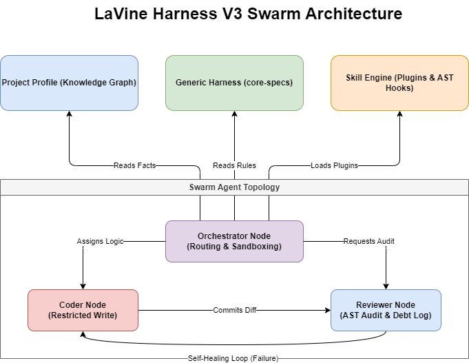
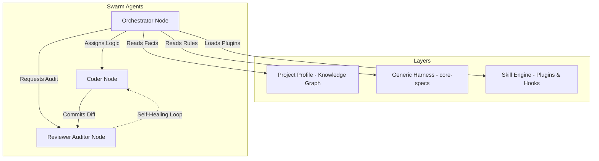

[📘 English](README.md) | [🇨🇳 简体中文](README-zh-CN-v2.md)

---

# LaVine Harness Skills: An Autonomous Agent-First Architecture Framework (V3.x)

## Abstract & Epistemological Stance

The **LaVine Harness Skills** initiative establishes a declarative, constraint-based operational framework—defined fundamentally as a "Harness"—specifically engineered to resolve the epistemic deterioration, context fragmentation, and hallucinatory scatter inherent in contemporary Large Language Models (LLMs) when interacting with complex repository namespaces. 

By pivoting fundamentally from anthropocentric, long-form prose towards a rigorously structured, **Machine-Readable** representation paradigm, this system mitigates unbounded autonomy. It provisions an agentic "sandbox," ensuring that generative IDE agents map their heuristic logic precisely to localized project definitions rather than relying on latent, probabilistic training weights.

## 🔬 Core Architectural Innovations

### 1. Declartive Ontological Mapping (Machine-Readable First paradigm)
Historical repositories optimize readability for human cognition, generating massive token overheads that inherently degrade LLM reasoning efficiency. This framework distills operational protocols, constraint matrices, and architecture definitions into zero-bloat `YAML/JSON` schema subsets housed securely within the unified `core-specs/` directory.

### 2. Tripartite Swarm Topology (Separation of Agency)
Unbounded, monolithic agent loops are prone to catastrophic failure cascades. The V3 framework imposes a strict Swarm Coordination Model decoupling execution bounds:
- **Orchestrator Node**: Constrained to task-routing and context ingestion. It lacks write permissions to functional subsystems.
- **Coder Node**: Restricted to an execution sandbox. Directed entirely by bounded sub-tasks and prevented from lateral repository access.
- **Reviewer Node**: Governs the self-healing and heuristic audit protocols. Iterates over AST differences mapping state variances against the pre-defined `debt-log-v2.md`.

### 3. Contextual Anti-Hallucination & Sliding Window Mechanics
Agents inherently hallucinate paths when confronted with informational sparsity. By centralizing absolute ground truths within isolated configurations, agents are programmed under an **"On-Demand Paging"** mechanism—only querying distinct modules (e.g., `SECURITY-v2.md`) dynamically, circumventing token limit exhaustion and maintaining a synthesized, contextually accurate execution state.

## 🗺️ V3 Architecture Topology





## 🛠️ Deployment & Execution Protocol

To effectively embed this framework and initialize a compliant AI workspace, strictly follow the operational handover sequence below:

### Phase 1: Contextual Bootstrapping
Direct the primary IDE agent (e.g., Claude Code, Cursor, GitHub Workspace) to digest the programmatic handshake matrix.
**Terminal Execution Protocol**:
> *"Initialize repository context mapping. Strict adherence to `CC-README-skills.md` bounding directives is mandatory. Acknowledge Swarm Role and confirm Sandbox read/write limitations."*

### Phase 2: Knowledge Graph Instantiation
Instead of passing isolated code snippets, trigger the agent to compile the global architectural reality by inspecting the core definition structures:
> *"Load the project domain topology. Parse the invariant constraints exclusively derived from `./core-specs/ARCHITECTURE-v2.md` and establish local environment logic routing."*

### Phase 3: Autonomous Orchestration
Allocate functional objectives under the restrictive agentic guardrails. Instruct the agent to autonomously generate code while routing all state validation through the local Reviewer node protocols. All generated structural drifts observed during operation will automatically populate error states into the architectural Quality Score logs instead of halting production logic irrecoverably.


## 📝 Citation

If you utilize the LaVine Harness framework or its swarm-topology constraints in your research or system architecture, please cite this project:

```bibtex
@software{lavine_harness_v3,
  author = {LaVineLeo},
  title = {LaVine Harness Skills: Agent-First Architecture Framework},
  year = {2026},
  version = {3.0},
  url = {https://github.com/LaVineLeo/LaVine-harness-skills}
}
```
